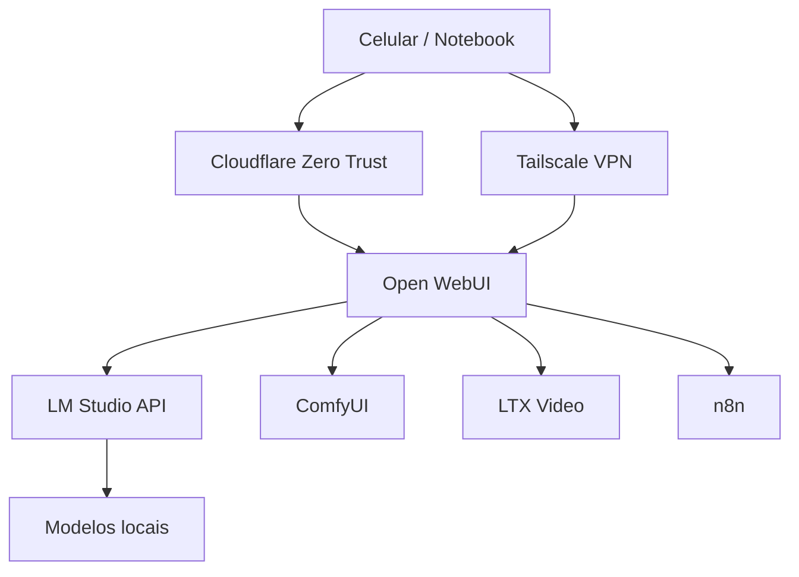

# Arquitetura

## Visão geral



## Conceito

O desktop não deve ser acessado como uma máquina remota comum. Ele deve funcionar como um servidor pessoal de IA.

O usuário acessa uma interface principal:

```text
Open WebUI
```

E por trás dela ficam:

- LM Studio para LLMs locais
- ComfyUI para imagem
- LTX Video para vídeo
- n8n para automações
- Tailscale e Cloudflare para acesso seguro

## Interfaces

| Serviço | Porta local | Uso |
|---|---:|---|
| LM Studio | 1234 | API OpenAI-compatible |
| Open WebUI | 3000 | Interface principal |
| ComfyUI | 8188 | Imagem |
| n8n | 5678 | Automações |
| LTX Video | variável | Vídeo |

## Publicação

O único serviço publicado por domínio é:

```text
https://ai.example.com -> http://localhost:3000
```

LM Studio, ComfyUI, n8n, Docker e SSH não devem ser publicados diretamente.
