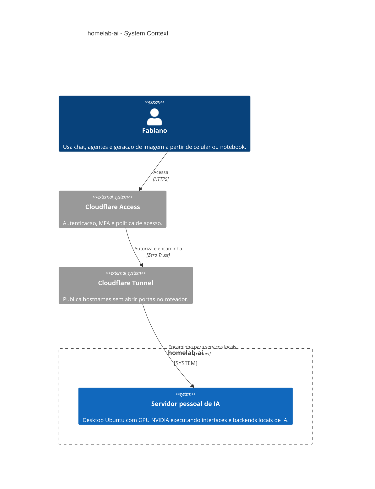
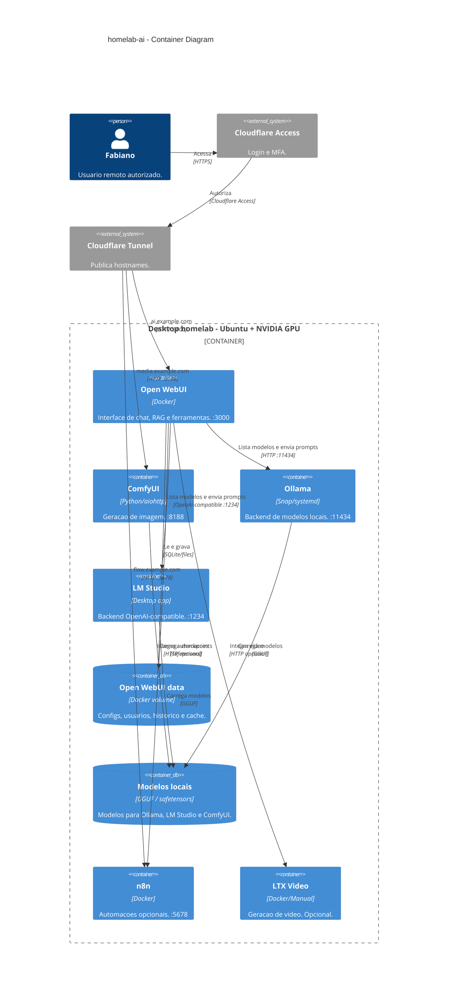

# Arquitetura

## C4 L1 - Contexto



## C4 L2 - Containers



## Interfaces

| Servico | Porta local | Exposicao | Uso |
|---|---:|---|---|
| Open WebUI | 3000 | `https://ai.example.com` via Cloudflare Access | Interface principal |
| ComfyUI | 8188 | `https://media.example.com` via Cloudflare Access | Geracao de imagem |
| n8n | 5678 | `https://flow.example.com` via Cloudflare Access | Automacoes |
| Ollama | 11434 | Interno | Backend do Open WebUI |
| LM Studio | 1234 | Interno | Backend OpenAI-compatible do Open WebUI |
| LTX Video | variavel | Interno/opcional | Video |

## Politica de Publicacao

Servicos publicados por dominio via Cloudflare Access:

```text
https://ai.example.com  -> http://localhost:3000
https://media.example.com -> http://localhost:8188
https://flow.example.com  -> http://localhost:5678
```

Ollama, LM Studio, n8n, Docker e SSH nao devem ser publicados diretamente. Ollama e LM Studio sao backends internos do Open WebUI.
