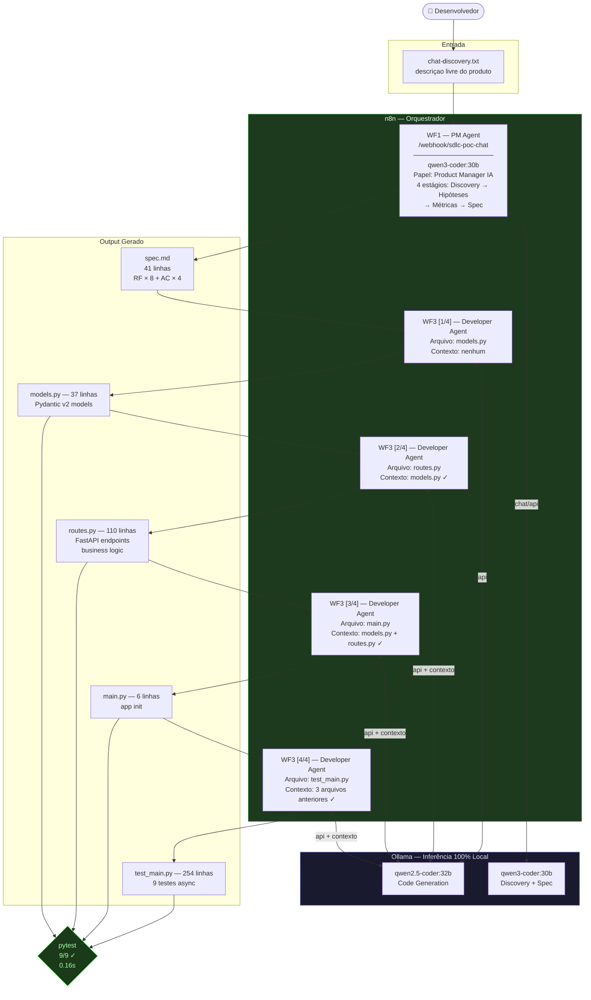
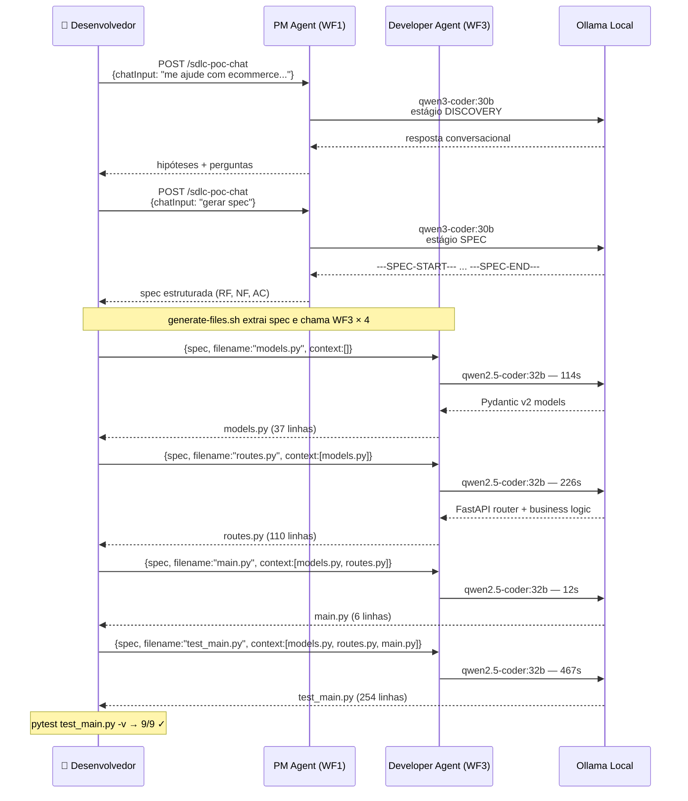
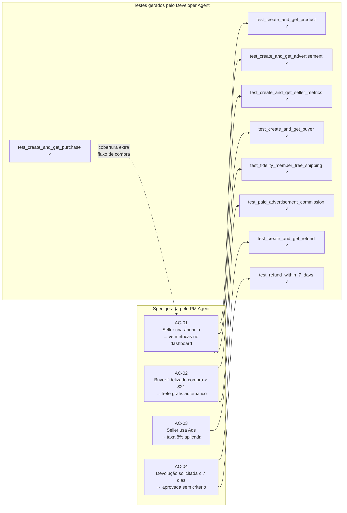
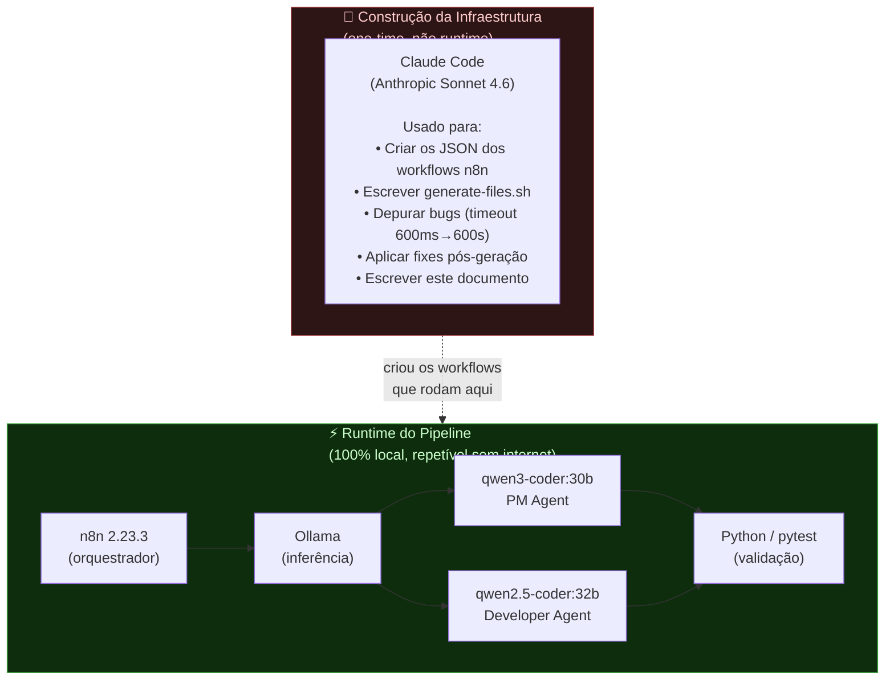
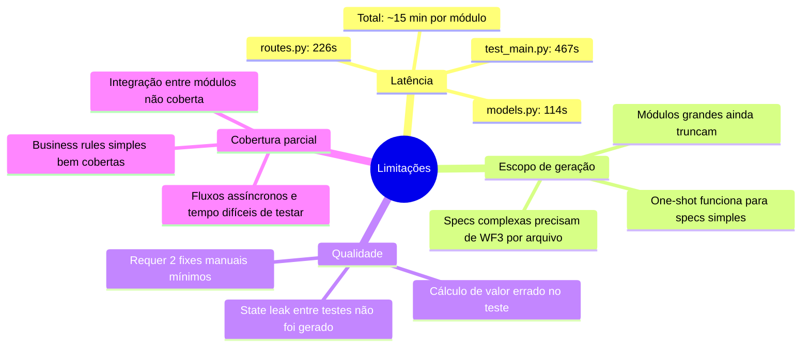

# Fluxo Agêntico Local — SDLC com 100% LLM Local

> Sessão de validação: 2026-06-20  
> Hardware: RTX 5060 Ti 16 GB VRAM  
> Inferência: Ollama (sem chamadas externas em runtime)

---

## 1. Visão Geral do Pipeline

---

## 2. O Que Cada Agente Fez

---

## 3. Cobertura dos Critérios de Aceite

---

## 4. O Que Foi Usado Onde

---

## 5. Métricas da Sessão

| Métrica | Valor |
|---|---|
| Tempo total discovery → pytest | ~15 min |
| Tokens processados localmente | ~150k (estimado) |
| Chamadas para APIs externas (runtime) | **0** |
| Arquivos gerados | 4 |
| Linhas de código geradas | 407 |
| Testes gerados | 9 |
| Testes passando as-generated | 7/9 |
| Testes passando pós-fix mínimo | **9/9** |
| Fixes manuais aplicados | 2 (autouse fixture + valor de cálculo) |

### Fixes que o contexto progressivo eliminou
Na geração anterior (sem contexto), eram necessários 4 fixes:
- `platform_fee_usd` → `platform_fee` (divergência de nome)
- `seller_net_usd` → `seller_net` (divergência de nome)
- Endpoint `/ledger` ausente
- Lógica de freeze com off-by-one

Com contexto progressivo, nenhum desses ocorreu. As **254 linhas** de `test_main.py` usaram exatamente os mesmos nomes de campo que `routes.py`.

---

## 6. Limitações Identificadas

---

## 7. Próximos Passos Naturais

1. **Contexto entre módulos** — gerar Seller Central com context de Fintech Core (wallet compartilhado)
2. **Modelo mais rápido** — testar `qwen2.5-coder:7b` para iteração (~15-30s/arquivo vs 2-8min)
3. **WF4 — UX Wireframe** — mesmo padrão, output HTML/Tailwind por tela
4. **Langfuse** — observabilidade: ver tokens, latência, qualidade por chamada
5. **Auto-fix loop** — WF4: rodar pytest → erros → prompt de fix → re-gerar arquivo com bug
