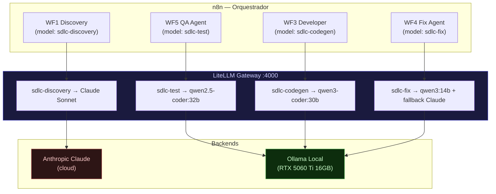

# Proposta C — Roteamento por Modelos Especialistas

**Prioridade:** Alta
**Viabilidade no homelab:** 5/5
**Relevancia para o SDLC:** 5/5
**Status:** Implementado (2026-06-20) — ver `docker/litellm-config.yaml` e `agents/sdlc-hybrid/`

---

## Resumo

Usar LiteLLM Proxy como camada de roteamento entre multiplos modelos Ollama, cada um especializado em um papel do ciclo SDLC. Na teoria, um modelo diferente atua como PM, Architect, Developer e Reviewer. Na pratica, a limitacao de 1 GPU impossibilita paralelismo — modelos trocam via swap, aumentando latencia. A solucao pratica e usar o mesmo modelo base (Qwen 3.5 14B) com system prompts especializados por papel, sem precisar do LiteLLM para comecar.

---

## Limitacao Critica: 1 GPU, 1 Modelo por Vez

Com 16GB VRAM e um modelo de 14B ocupando ~8GB, tecnicamente seria possivel carregar 2 modelos simultaneamente. Porem:

1. **Contexto isolado:** cada modelo carregado tem seu proprio contexto — nao ha comunicacao direta entre modelos na memoria
2. **Gerenciamento pelo Ollama:** o Ollama descarrega o modelo da VRAM apos timeout de inatividade (padrao: 5 minutos). Carregar um modelo diferente descarrega o anterior.
3. **Na pratica:** em um ciclo SDLC com fases sequenciais, so um papel (modelo) atua por vez — nao ha necessidade de paralelismo real

**Conclusao:** a proposta de "multiplos modelos rodando em paralelo com papeis diferentes" nao e viavel com 16GB VRAM. A proposta se reduz a: **um modelo por fase, carregado e descarregado conforme necessario**.

---

## Solucao Alternativa: System Prompts Especializados

Em vez de multiplos modelos, usar o **mesmo modelo (Qwen 3.5 14B Q4_K_M)** com system prompts diferentes para cada papel. Isso elimina o overhead de troca de modelos e o custo de configuracao do LiteLLM.

### Tabela de System Prompts por Papel

| Papel | Fase SDLC | System Prompt Base |
|---|---|---|
| Product Manager | 01-Discovery, 02-Hipoteses, 05-Specs | Ver abaixo |
| UX Designer | 03-UX Design | Ver abaixo |
| Architect | 04-Arquitetura | Ver abaixo |
| Developer | 06-Spec to Code | Ver abaixo |
| Reviewer | 06 (revisao) | Ver abaixo |
| QA | 07-CI/CD | Ver abaixo |
| Analyst | 08-Monitoring, 09-Feedback | Ver abaixo |

#### System Prompt: Product Manager

```
Voce e um Product Manager experiente em desenvolvimento de software agêntico.
Seu papel e analisar contexto de negocio, identificar problemas e oportunidades,
formular hipoteses testáveis e produzir documentos de requisitos claros e acionáveis.

Sempre produza output estruturado em markdown com secoes claras.
Priorize clareza sobre completude — melhor um PRD conciso e claro do que longo e vago.
Ao formular hipoteses, use o formato: "Se [acao], entao [resultado mensuravel], porque [raciocinio]".
```

#### System Prompt: UX Designer

```
Voce e um UX Designer especializado em interfaces tecnicas e ferramentas de desenvolvedor.
Seu papel e converter requisitos de negocio em fluxos de usuario, wireframes em texto/ASCII,
e criterios de aceitacao de experiencia.

Nao gere imagens — use ASCII art, mermaid ou descricao textual detalhada de layouts.
Estruture output como: 1) Personas afetadas, 2) Fluxo de telas (ASCII ou texto),
3) User stories no formato "Como [persona], quero [acao] para [beneficio]",
4) Criterios de aceitacao de UX mensurais.
```

#### System Prompt: Architect

```
Voce e um Arquiteto de Software com expertise em sistemas distribuidos e arquitetura de software.
Seu papel e analisar requisitos e propor arquiteturas, avaliar tradeoffs e documentar decisoes
em formato ADR (Architecture Decision Record).

Sempre que propuser uma decisao arquitetural, use o formato ADR:
- Titulo
- Status (Proposto/Aceito/Depreciado)
- Contexto
- Decisao
- Consequencias

Para diagramas, use mermaid ou ASCII art. Nao use ferramentas externas.
```

#### System Prompt: Developer

```
Voce e um Desenvolvedor Senior focado em escrever codigo limpo, testável e bem documentado.
Seu papel e converter specs tecnicas em codigo de producao, seguindo as convencoes do projeto.

Sempre leia os arquivos de arquitetura e convencoes antes de gerar codigo.
Gere codigo em blocos atomicos — um arquivo por vez, completo.
Inclua testes unitarios para cada funcao publica.
Documente assumptions e pontos de atencao como comentarios no codigo.
```

#### System Prompt: Code Reviewer

```
Voce e um Code Reviewer focado em qualidade, seguranca e aderencia a convencoes.
Recebe diffs de codigo e fornece feedback estruturado.

Formato de output:
- CRITICO: problemas que impedem merge (bugs, vulnerabilidades de seguranca)
- IMPORTANTE: melhorias de qualidade significativas
- SUGESTAO: melhorias opcionais de estilo ou legibilidade
- APROVADO: aspectos bem implementados

Seja objetivo e especifico — cite linha e arquivo para cada item.
```

#### System Prompt: QA

```
Voce e um engenheiro de QA focado em automacao de testes e validacao de deploys.
Seu papel e gerar casos de teste, verificar cobertura e validar criterios de aceitacao.

Gere casos de teste no formato: dado [precondition], quando [acao], entao [resultado esperado].
Priorize: testes de regressao para paths criticos, testes de borda, testes de seguranca basica.
Output esperado: lista de casos de teste em markdown e/ou codigo de teste executavel.
```

#### System Prompt: Analyst

```
Voce e um Analista de Dados especializado em metricas de produto e observabilidade de sistemas.
Seu papel e interpretar logs, metricas e KPIs para identificar anomalias, tendencias e oportunidades.

Ao analisar dados, sempre responda: 1) O que esta acontecendo (fatos), 2) Por que pode estar acontecendo
(hipoteses), 3) O que deve ser feito (recomendacoes priorizadas por impacto).
Formato de output: executive summary (2-3 linhas) seguido de analise detalhada.
```

---

## Pros

- Cada fase usa o prompt/sistema otimizado para aquele papel — melhora qualidade do output
- Custo zero, privacidade total
- Com um unico modelo, sem overhead de troca de VRAM
- Extensivel: novos papeis = novos system prompts, sem instalar nada

## Contras

- Com 16GB VRAM, so roda um modelo por vez — se quiser modelos especializados diferentes por papel, ha latencia de troca
- Modelos de 14B nem sempre aderem perfeitamente ao formato de output esperado — exige prompt engineering cuidadoso
- Sem estado entre chamadas — cada invocacao e stateless; o contexto acumulado deve ser passado explicitamente

---

## Quando Usar LiteLLM Proxy

O LiteLLM so faz sentido quando:

1. **Fallback para API externa:** voce quer que chamadas que falham no Ollama local escalem automaticamente para Claude API ou OpenAI — o LiteLLM faz esse roteamento de forma transparente
2. **Multiplos hosts:** voce tem mais de um servidor rodando diferentes modelos e quer um endpoint unificado
3. **Rate limiting e observabilidade:** o LiteLLM tem middleware de log e rate limiting que pode complementar o Langfuse

Para o homelab atual com 1 GPU, o LiteLLM e complexidade desnecessaria — a integracao direta via Ollama HTTP API e mais simples.

---

## Como Configurar LiteLLM Proxy com Ollama (Para Futuro)

```yaml
# litellm-config.yaml
model_list:
  - model_name: pm-model
    litellm_params:
      model: ollama/qwen3.5:14b
      api_base: http://ollama:11434
      system_prompt: "Voce e um Product Manager..."

  - model_name: dev-model
    litellm_params:
      model: ollama/devstral
      api_base: http://ollama:11434
      system_prompt: "Voce e um Developer Senior..."

  - model_name: fallback-claude
    litellm_params:
      model: claude-sonnet-4-5
      api_key: os.environ/ANTHROPIC_API_KEY

router_settings:
  # Se ollama falhar ou demorar mais de 30s, usar Claude API
  fallbacks: [{"pm-model": ["fallback-claude"]}]
  num_retries: 2
  timeout: 30
```

```bash
# Docker para LiteLLM
docker run -d \
  --name litellm \
  --network homelab-network \
  -p 4000:4000 \
  -v /path/to/litellm-config.yaml:/app/config.yaml \
  -e ANTHROPIC_API_KEY=${ANTHROPIC_API_KEY} \
  ghcr.io/berriai/litellm:main \
  --config /app/config.yaml --port 4000 --detailed_debug
```

Apos configurado, qualquer ferramenta que fala OpenAI API pode apontar para `http://litellm:4000` e usar os modelos via alias (`pm-model`, `dev-model`, etc.).

---

## Implementação Real: n8n + LiteLLM (jun/2026)

A proposta foi implementada usando **n8n como orquestrador** (reusando o pipeline TDD+auto-fix ja validado) e **LiteLLM como gateway de roteamento**, em vez de redesenhar a orquestração.

### Arquitetura implementada



### Roteamento por ambiguidade

| Fase | Ambiguidade | Modelo | Custo/feature |
|---|---|---|---|
| Discovery (WF1) | Alta | Claude Sonnet | ~$0.02 |
| Test-gen (WF5) | Baixa (ACs explícitos) | qwen2.5-coder:32b | $0 |
| Code-gen (WF3) | Baixa (spec estruturada) | qwen3-coder:30b | $0 |
| Fix (WF4) | Baixa-média | qwen3:14b → Claude fallback | $0–$0.02 |
| **Total estimado** | | | **~$0.04–0.07/feature** |

### Estratégia incremental de migração

WF1 já aponta para LiteLLM (Discovery → Claude). WF3/4/5 ainda chamam Ollama nativo — podem ser migrados para o LiteLLM a qualquer momento sem mudar a lógica, apenas para ter tracking unificado de custo e fallback automático.

### Subir o stack híbrido

```bash
# Copiar chave (nunca commitar):
echo "ANTHROPIC_API_KEY=sk-ant-..." > docker/.env

# Subir n8n + LiteLLM:
docker compose --profile optional up -d n8n litellm

# Smoke test:
curl http://localhost:4000/health
curl -X POST http://localhost:4000/v1/chat/completions \
  -H "Content-Type: application/json" \
  -d '{"model":"sdlc-codegen","messages":[{"role":"user","content":"ping"}]}'

# Reimportar WF1 atualizado no n8n:
cd agents/sdlc-poc/tests && ./import-workflows.sh
```
