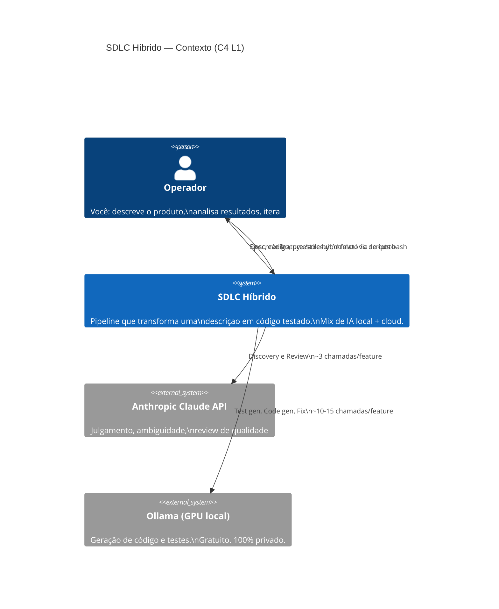
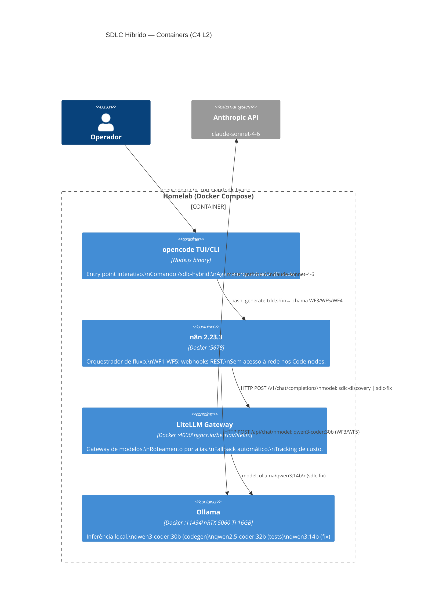
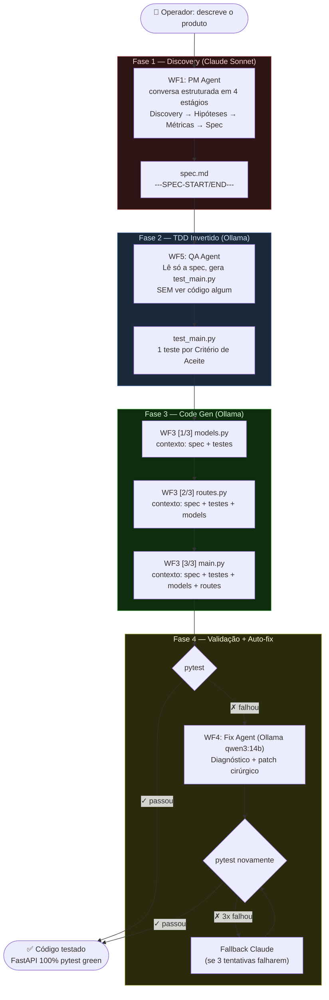
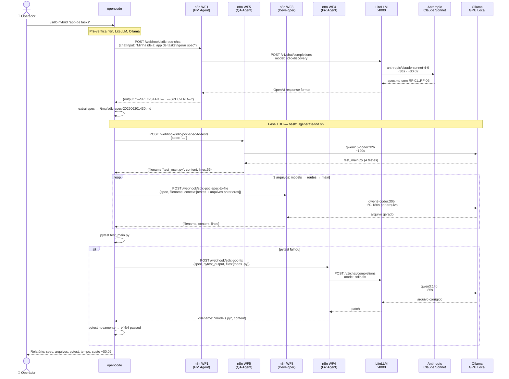
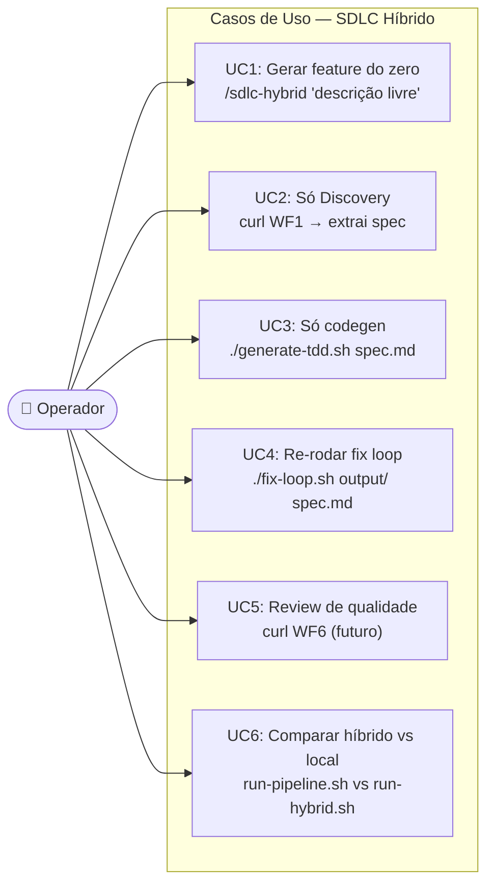
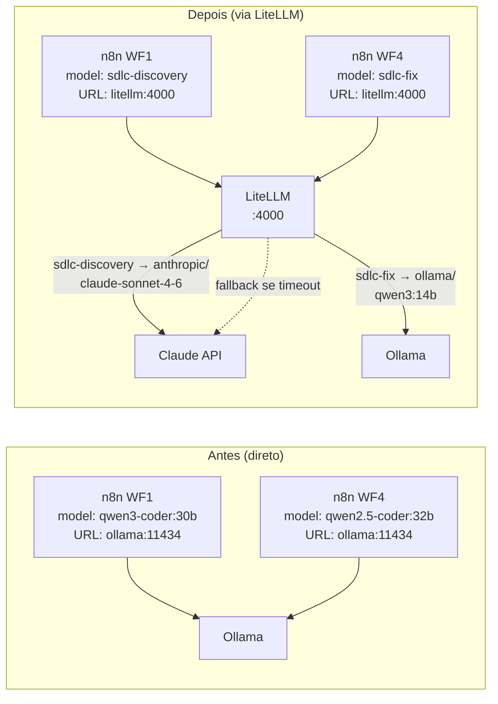

# SDLC Híbrido — Visão Geral de Arquitetura

> Última atualização: 2026-06-20  
> Hardware: RTX 5060 Ti 16 GB VRAM · Ubuntu · Ollama + Docker Compose  
> Status: Operacional

---

## 1. O que é o SDLC Híbrido?

Um pipeline de desenvolvimento de software onde **cada fase é executada pelo modelo com melhor custo-benefício** para aquela tarefa específica — não por um único modelo tentando fazer tudo.

O princípio central é **roteamento por ambiguidade**:

| Ambiguidade | Exemplo de tarefa | Modelo ideal |
|---|---|---|
| **Alta** | Interpretar uma descrição vaga, decidir o que construir, avaliar qualidade | Claude Sonnet (cloud) |
| **Baixa** | Gerar código a partir de spec estruturada, escrever testes de ACs explícitos | Ollama local (gratuito) |

Resultado: ~$0.04–0.07 por feature completa (vs $0.50–2.00 tudo-Claude ou $0 com mais fixes manuais tudo-local).

---

## 2. C4 — Nível 1: Contexto do Sistema



**O que o operador vê:** uma descrição em linguagem natural entra, código FastAPI testado e aprovado pelo pytest sai. O roteamento entre Claude e Ollama é transparente.

---

## 3. C4 — Nível 2: Containers



### Responsabilidades por container

| Container | Responsabilidade | O que NÃO faz |
|---|---|---|
| **opencode** | Entry point interativo; orquestração bash; relatório | Não gera código diretamente |
| **n8n** | Sequenciamento de fases; system prompts especializados; retry | Não decide qual modelo usar (isso é o LiteLLM) |
| **LiteLLM** | Roteamento por alias; fallback; unified cost tracking | Não orquestra fases |
| **Ollama** | Inferência GPU local pura | Não tem sistema de fallback |

---

## 4. O Ciclo SDLC — Visão de Processo



### Por que TDD Invertido?

O QA Agent gera os testes **sem ver o código** — só a spec. Isso elimina a circularidade onde o mesmo modelo gera o código e os testes, validando suas próprias suposições. Com TDD Invertido, o código é **forçado a satisfazer um contrato escrito por um agente diferente**.

Resultado medido: 0 fixes manuais vs 2 fixes manuais no modo code-first.

---

## 5. Diagrama de Sequência — Caminho Feliz



---

## 6. Use Cases — Perspectiva do Operador



### Como cada UC é acionado na prática

| Caso de uso | Comando | Quando usar |
|---|---|---|
| **UC1 — Feature completa** | `opencode run --command sdlc-hybrid "descrição"` | Nova feature do zero, ideia vaga |
| **UC2 — Só Discovery** | `curl POST /webhook/sdlc-poc-chat` | Você quer a spec mas vai implementar manualmente |
| **UC3 — Só TDD+Codegen** | `./generate-tdd.sh spec.md /tmp/out` | Spec já existe (outra fonte) |
| **UC4 — Re-fix** | `./fix-loop.sh /tmp/out spec.md 5` | Pytest falhou, quer mais tentativas |
| **UC5 — Review** | (WF6 planejado) | Antes de PR, validação de qualidade |
| **UC6 — Comparação** | Dois terminais | Benchmarking custo/qualidade |

### Experiência típica de uma feature (UC1)

```
$ opencode run --command sdlc-hybrid "sistema de gestão de estoque com alertas de reposição"

[opencode / Claude Sonnet como orquestrador]

▶ Verificando serviços...  n8n ✓  LiteLLM ✓  Ollama ✓

▶ Discovery (Claude Sonnet via WF1)...
  → 28s · spec gerada: 6 RFs, 4 ACs
  → salvo: /tmp/sdlc-spec-202506201430.md

▶ QA Agent: gerando test_main.py (qwen2.5-coder:32b)...
  → 190s · 4 testes, 56 linhas

▶ Developer Agent: models.py...  [54s]
▶ Developer Agent: routes.py...  [180s]
▶ Developer Agent: main.py...    [14s]

▶ pytest... 2 falhas (KeyError: quantidade_alerta)
▶ Fix Agent (qwen3:14b)...       [85s]  → models.py corrigido
▶ pytest... ✅ 4/4 passed

## Relatório Final
Spec:  6 requisitos funcionais
Código: models.py (42L), routes.py (78L), main.py (31L)
Testes: 4/4 passed · 1 fix automático
Tempo: 28s discovery + ~7min codegen + ~2min fix = ~10min total
Custo: ~$0.02 (Discovery Claude) + $0.00 (Ollama) = ~$0.02
```

---

## 7. Como o LiteLLM Joga o Jogo

### O problema sem o LiteLLM

Antes do LiteLLM, cada workflow n8n chamava **diretamente** um backend fixo:

```
WF1 → http://ollama:11434/api/chat  (Ollama API format)
WF3 → http://ollama:11434/api/chat  (modelo hardcoded no jsCode)
WF4 → http://ollama:11434/api/chat  (modelo hardcoded no jsCode)
```

Isso criava três problemas:

1. **Sem roteamento inteligente** — para trocar WF1 de Ollama para Claude, era preciso editar o JSON do workflow, reimportar no n8n e reiniciar. Modelo hardcoded = inflexibilidade.

2. **Sem fallback** — se o modelo local travasse (VRAM cheia, timeout), o workflow simplesmente falhava. Nenhum mecanismo de escalada para modelo cloud.

3. **Sem visibilidade de custo** — zero tracking de tokens. Impossível saber quanto custa cada fase ou comparar modelos.

### A solução com LiteLLM

O LiteLLM é inserido como **camada única de abstração entre o n8n e os modelos**:



### O que o LiteLLM resolve na prática

| Problema | Como o LiteLLM resolve |
|---|---|
| **Modelo hardcoded** | n8n passa `model: "sdlc-discovery"` — um alias. O mapeamento real (para Claude ou Ollama) está no `litellm-config.yaml`. Troca de modelo = editar 1 linha no YAML, sem tocar nos workflows. |
| **Sem fallback** | `fallbacks: [{sdlc-fix: [sdlc-review]}]` — se `qwen3:14b` exceder o timeout ou retornar erro, o LiteLLM automaticamente escala a chamada para Claude. O n8n não sabe da diferença. |
| **Sem visibilidade** | O LiteLLM loga cada chamada com tokens, latência e custo calculado. Com Langfuse (próximo passo do backlog), isso vira um dashboard. |
| **Formato de API diferente** | Ollama nativo usa `/api/chat` com `options.temperature`. Claude usa `/v1/chat/completions` com `temperature` no topo. O LiteLLM expõe **sempre** OpenAI format — os workflows falam um único formato. |

### Mapa de roteamento atual

```yaml
# docker/litellm-config.yaml
sdlc-discovery  →  anthropic/claude-sonnet-4-6   # WF1 (Discovery)
sdlc-review     →  anthropic/claude-sonnet-4-6   # WF6 (Review, futuro)
sdlc-codegen    →  ollama/qwen3-coder:30b         # WF3 (Code gen)
sdlc-test       →  ollama/qwen2.5-coder:32b       # WF5 (Test gen)
sdlc-fix        →  ollama/qwen3:14b               # WF4 (Fix), com fallback Claude
```

### O que o LiteLLM NÃO faz

- **Não orquestra fases** — quem decide "agora gera testes, agora gera código" é o n8n (e o bash wrapper).
- **Não mantém contexto entre chamadas** — cada chamada é stateless. O contexto acumulado (arquivos já gerados) é passado explicitamente pelo n8n no payload.
- **Não resolve problemas de qualidade** — se o modelo local gerar código ruim, o LiteLLM entrega fielmente. A qualidade vem dos system prompts e do TDD Invertido.

---

## 8. Stack Completa em Uma Linha

```
Operador → opencode (Claude orquestra) → n8n (sequencia fases) → LiteLLM (roteia) → Claude (julgamento) | Ollama (geração)
```

Cada componente tem responsabilidade única. Remover qualquer um degrada uma capability específica mas não derruba o sistema inteiro — você pode, por exemplo, chamar os webhooks do n8n diretamente sem o opencode, ou apontar os workflows para Ollama nativo sem o LiteLLM.

---

## 9. Como Subir o Stack Completo

```bash
# Pré-requisito: ANTHROPIC_API_KEY no ambiente (nunca no repo)
export ANTHROPIC_API_KEY="sk-ant-..."

# 1. Subir n8n + LiteLLM (Ollama e Open WebUI já sobem no profile padrão)
cd ~/homelab-ai/docker
docker compose --profile optional up -d n8n litellm

# 2. Importar e ativar os workflows n8n
cd ~/homelab-ai/agents/sdlc-poc/tests
./import-workflows.sh

# 3. Smoke test
curl http://localhost:4000/health          # LiteLLM ok
curl http://localhost:5678/healthz         # n8n ok

# 4. Rodar o pipeline híbrido
opencode run --command sdlc-hybrid "descreva sua feature aqui"
```

**Referências:**
- `docker/litellm-config.yaml` — mapeamento de aliases → modelos
- `agents/sdlc-poc/workflows/` — WF1-5 (JSON do n8n)
- `agents/sdlc-poc/tests/generate-tdd.sh` — pipeline TDD bash
- `.opencode/commands/sdlc-hybrid.md` — skill opencode
- `docs/sdlc-agentico/proposals/C-model-routing.md` — decisão de arquitetura
