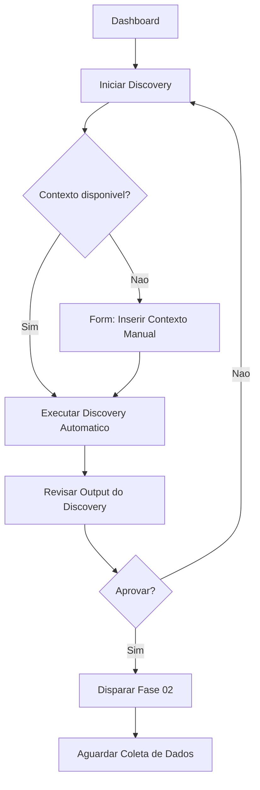

# Fase 03 — UX Design

## O Que e Esta Fase

UX Design no contexto agêntico local significa converter hipoteses e requisitos em fluxos de usuario, user stories e criterios de aceitacao — tudo em formato texto/markdown. Modelos locais de 14B nao geram imagens; o output de UX e inteiramente textual: wireframes em ASCII, fluxos de navegacao em mermaid, e criterios de aceitacao de experiencia.

Para projetos que precisam de mockups visuais, o ComfyUI ja rodando no homelab pode gerar imagens de interface a partir de prompts — mas isso e um passo manual fora do loop automatico.

---

## O Que o Modelo Pode Gerar

| Artefato | Qualidade com 14B | Observacoes |
|---|---|---|
| User stories | Alta | Forte ponto dos modelos de linguagem |
| Criterios de aceitacao | Alta | Bom em detalhar o "done" |
| Wireframes em ASCII | Media | Funcional, nao bonito |
| Fluxos de navegacao (texto) | Alta | "Tela A -> Botao X -> Tela B" |
| Diagramas de fluxo (mermaid) | Media-Alta | Funciona bem para fluxos simples |
| Personas | Alta | Muito bom em descrever personas com contexto |
| Principios de UX a seguir | Alta | Guias de estilo, heuristicas |
| Mockups visuais | Nao aplicavel | Requer ComfyUI (fora do loop automatico) |

---

## Limitacoes dos Modelos Locais para UX

1. **Sem geracao de imagens:** modelos de linguagem locais (Qwen, Devstral, etc.) sao texto apenas. Para imagens, usar ComfyUI (ja instalado no homelab) separadamente.

2. **Wireframes em ASCII sao aproximados:** util para comunicar layout, mas nao substitui ferramentas de prototipagem como Figma para validacao com usuarios.

3. **Sem interatividade:** o modelo nao pode simular o comportamento de uma interface — apenas descreve.

4. **Contexto de produto limitado:** sem historico do produto no contexto, o modelo pode gerar user stories genericas. Fornecer exemplos de telas existentes (como texto/screenshot descrito) melhora muito a relevancia.

---

## Alternativas para Artefatos Visuais

| Necessidade | Alternativa no Homelab | Como Usar |
|---|---|---|
| Mockup de tela | ComfyUI + Stable Diffusion | Prompt descritivo de UI → imagem de mockup |
| Diagrama de fluxo | Mermaid (gerado pelo LLM) | Renderizar no VS Code, GitLab, ou mermaid.live |
| Wireframe interativo | Nenhum no homelab — pular para HTML | Gerar HTML/CSS simples com LLM |
| Prototipo clickavel | Nenhum local — usar Penpot self-hosted | Penpot pode ser adicionado ao Docker Compose |

---

## System Prompt para UX Designer LLM

```
Voce e um UX Designer especializado em interfaces tecnicas, ferramentas de desenvolvedor
e sistemas internos. Trabalha em ciclo de desenvolvimento agêntico onde todo output precisa
ser em formato texto (markdown, ASCII, mermaid).

Ao receber requisitos, produza:

1. PERSONAS AFETADAS
   Para cada tipo de usuario, descreva: cargo/papel, objetivo principal, frustracao atual,
   nivel tecnico, frequencia de uso esperada.

2. FLUXO DE TELAS
   Use texto estruturado ou ASCII art. Cada tela deve ter:
   - Nome da tela
   - Elementos principais visíveis
   - Acoes possiveis (botoes, links, formularios)
   - Transicao para proxima tela

3. USER STORIES
   Formato obrigatorio: "Como [persona], quero [acao] para [beneficio]"
   Cada story deve ter criterios de aceitacao especificos.

4. CRITERIOS DE ACEITACAO DE UX
   Para cada user story, liste 2-4 criterios mensuráveis. Ex:
   - O formulario deve dar feedback em < 200ms apos submit
   - O erro de validacao deve aparecer inline, abaixo do campo, em vermelho
   - A tela deve carregar em < 2 segundos em conexao 4G simulada

Nao use emojis. Nao invente requisitos. Baseie-se apenas no contexto fornecido.
Se um requisito for ambiguo, liste a ambiguidade explicitamente em vez de assumir.
```

---

## Exemplos de Output Esperado

### Wireframe em ASCII

```
+------------------------------------------+
|  [Logo]        Dashboard        [User v] |
+------------------------------------------+
|  Sidebar           | Conteudo Principal  |
|  [ ] Discovery     |                     |
|  [ ] Specs         |  +----------------+ |
|  [ ] Builds   (3)  |  | Ciclo Atual    | |
|  [ ] Monitoring    |  | Fase: 03-UX    | |
|                    |  | Status: em andamento |
|  [+ Novo Ciclo]    |  +----------------+ |
+------------------------------------------+
```

### Fluxo de Navegacao em Mermaid



### User Story com Criterios de Aceitacao

```markdown
**US-01:** Como desenvolvedor usando o SDLC agêntico, quero ver o status de cada fase
do ciclo atual em um dashboard para entender onde o ciclo esta parado e intervir se necessario.

**Criterios de aceitacao:**
- AC1: O dashboard exibe todas as 9 fases com indicadores de status (nao iniciada / em andamento / concluida / falhou)
- AC2: A fase atual e destacada visualmente (borda colorida ou indicador de progresso)
- AC3: O timestamp do ultimo update de cada fase e exibido em formato relativo ("ha 5 minutos")
- AC4: Clicar em uma fase exibe o output gerado por ela (log expansivel)
- AC5: O botao "Intervir" aparece quando uma fase esta em estado "falhou" ha mais de 10 minutos
```

---

## Como Conectar ao n8n

```
Workflow: "03 - UX Design"

[Webhook: recebe hipoteses priorizadas da fase 02]
     |
     v
[IF: hipotese tem componente de interface/usuario?]
  |-- Sim: continua o workflow
  |-- Nao: skippa para fase 04 (apenas tecnico)
     |
     v
[HTTP: Ollama — gerar personas]
  model: qwen3.5:14b
  prompt: "Com base nos requisitos {{ req }}, descreva as personas afetadas..."
     |
     v
[HTTP: Ollama — gerar user stories e wireframes]
  prompt: "Para as personas identificadas, crie user stories com criterios de aceitacao..."
     |
     v
[HTTP: Ollama — gerar fluxo mermaid]
  prompt: "Crie um diagrama mermaid do fluxo de navegacao para estas user stories..."
     |
     v
[Write File: /data/sdlc-state/03-ux-design.md]
     |
     v
[Wait for Webhook: aguardar aprovacao humana]
  timeout: 24h
  on_timeout: continuar automaticamente
     |
     v
[Disparar Fase 04]
```

---

## Quando Esta Fase Pode Ser Pulada

Nem todo ciclo SDLC passa pela fase de UX Design. Esta fase pode ser pulada quando:

- A hipotese e puramente tecnica (ex: "adicionar cache Redis reduz latencia")
- A tarefa e um bugfix interno sem impacto em interface
- O escopo e uma mudanca de infraestrutura (CI/CD, Docker config)
- A feature ja tem UX definida de ciclo anterior e apenas adiciona comportamento

O workflow n8n da fase 02 inclui um node de decisao que roteia para fase 03 (se houver componente de UX) ou direto para fase 04 (se for tecnica pura).
