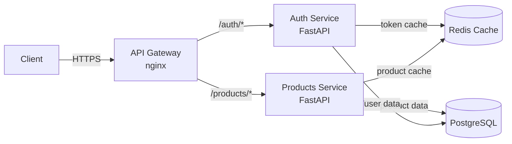

# Fase 04 — Arquitetura

## O Que e Esta Fase

Arquitetura e a fase de decisao tecnica: dado o problema identificado (discovery) e os requisitos (specs/UX), qual e a melhor estrutura de solucao? O LLM local atua como Architect, propondo componentes, avaliando tradeoffs, e documentando decisoes em formato ADR (Architecture Decision Record).

Modelos de 14B fazem bem as partes analiticas da arquitetura — avaliar tradeoffs, escrever ADRs, gerar diagramas em texto/mermaid. O ponto fraco e raciocinio de sistemas muito grandes (>50 arquivos de codebase) onde o modelo pode perder coerencia entre decisoes.

---

## O Que LLMs Locais Fazem Bem em Arquitetura

| Tarefa | Qualidade com 14B | Observacao |
|---|---|---|
| Escrever ADRs | Alta | Formato estruturado beneficia modelos de linguagem |
| Avaliar tradeoffs (2-3 opcoes) | Alta | Bom em comparacoes qualitativas |
| Gerar diagramas mermaid | Media-Alta | Funciona para sistemas de media complexidade |
| Propor stack tecnologico | Alta | Especialmente com contexto do projeto |
| Identificar riscos tecnico | Media | Bom para riscos obvios, pode perder os sutis |
| Modelagem de dados | Alta | ER diagrams em texto, schema SQL |
| Definir contratos de API | Alta | OpenAPI/Swagger em YAML, interfaces TypeScript |
| Decomposicao em servicos | Media | Ok para microservicos simples, fraco em sistemas complexos |

## Limitacoes

| Limitacao | Impacto | Mitigacao |
|---|---|---|
| Janela de contexto limitada | Perde coerencia em codebases > 50 arquivos | Usar RAG (Qdrant) para recuperar arquivos relevantes |
| Sem visao do runtime atual | Nao sabe o que esta rodando em producao | Passar estado atual como contexto explicitio |
| Raciocinio de sistemas distribuidos | Pode propor arquiteturas com falhas de consistencia | Revisar ADRs com checklist humano |
| Conhecimento de versoes (cutoff) | Pode sugerir versoes desatualizadas de libs | Fornecer versoes atuais no contexto |

---

## System Prompt para Architect LLM

```
Voce e um Arquiteto de Software Senior com experiencia em sistemas distribuidos,
arquitetura de microservicos, e desenvolvimento agêntico.

Ao receber requisitos, voce deve:

1. ANALISE DE OPCOES ARQUITETURAIS
   Apresente 2-3 alternativas de arquitetura para o problema.
   Para cada alternativa, liste pros, contras e cenarios onde e a melhor escolha.

2. DECISAO RECOMENDADA
   Escolha a melhor alternativa com justificativa clara.
   Aponte os riscos da decisao escolhida e como mitigá-los.

3. ADR (Architecture Decision Record)
   Documente a decisao no formato ADR padrao (ver template abaixo).

4. DIAGRAMA
   Produza um diagrama em mermaid ou ASCII art mostrando os componentes
   e suas interacoes.

5. PLANO DE IMPLEMENTACAO DE ALTO NIVEL
   Liste as etapas de implementacao na ordem correta, com dependencias entre elas.

Seja conservador: prefira solucoes simples que funcionam a solucoes elegantes que podem falhar.
Cite explicitamente qualquer suposicao que voce estiver fazendo sobre o ambiente.
```

---

## Template de ADR (Architecture Decision Record)

```markdown
# ADR-[numero]: [Titulo da Decisao]

**Data:** YYYY-MM-DD
**Status:** Proposto / Aceito / Depreciado / Substituido por ADR-XX

## Contexto

[Descreva o problema que motivou esta decisao. Qual e a situacao atual?
Quais restricoes existem (tempo, budget, hardware, equipe)?]

## Opcoes Consideradas

### Opcao A: [Nome]
**Pros:** [lista]
**Contras:** [lista]
**Quando usar:** [cenario ideal]

### Opcao B: [Nome]
**Pros:** [lista]
**Contras:** [lista]
**Quando usar:** [cenario ideal]

### Opcao C: [Nome] (se aplicavel)
[mesmo formato]

## Decisao

Escolhemos **Opcao [X]** porque [justificativa principal em 1-3 frases].

## Consequencias

**Positivas:**
- [resultado esperado 1]
- [resultado esperado 2]

**Negativas/Riscos:**
- [risco 1] — Mitigacao: [como reduzir]
- [risco 2] — Mitigacao: [como reduzir]

**Dependencias criadas:**
- [o que esta decisao torna necessario]

## Revisao em

[Data ou evento que deve triggar revisao desta decisao]
```

---

## Diagramas em Mermaid

O LLM local gera diagramas mermaid com qualidade razoavel para sistemas de media complexidade. Exemplos de prompts:

### Diagrama de Componentes

```
Gere um diagrama mermaid de componentes para a seguinte arquitetura:
- API Gateway (nginx)
- Servico de Autenticacao (FastAPI)
- Servico de Produtos (FastAPI)
- Cache Redis
- Banco de dados PostgreSQL
Mostre as dependencias e o fluxo de dados.
```

Output esperado:



---

## Mitigacao: Dividir em Sub-Decisoes

Para sistemas grandes, em vez de pedir "arquitete o sistema inteiro", dividir em sub-decisoes menores:

```
Sessao 1: "Arquitete apenas a camada de autenticacao"
Sessao 2: "Dado que a autenticacao usa JWT, arquitete a camada de API Gateway"
Sessao 3: "Dado o API Gateway definido, arquitete os servicos de negocio"
```

Cada sub-decisao gera um ADR independente. O n8n pode orquestrar essas sessoes sequencialmente, passando o contexto acumulado de ADRs anteriores como input.

---

## RAG para Contexto de Codebase Longo

Para projetos com muitos arquivos, usar Qdrant + RAG para recuperar apenas os arquivos relevantes:

```python
# Pseudocodigo — busca semantica antes de chamar o LLM
from qdrant_client import QdrantClient

client = QdrantClient(host="qdrant", port=6333)

# Buscar arquivos relevantes para a decisao de arquitetura
resultados = client.search(
    collection_name="codebase",
    query_vector=embed("autenticacao JWT middleware"),
    limit=5
)

# Passar apenas os arquivos relevantes como contexto
contexto_relevante = [r.payload["conteudo"] for r in resultados]
```

Isso e especialmente util na fase 04 quando a decisao de arquitetura depende de entender o codigo existente.

---

## Integracao no n8n

```
Workflow: "04 - Arquitetura"

[Webhook: recebe hipoteses + user stories]
     |
     v
[Execute Command: coletar contexto de arquitetura existente]
  - cat ARCHITECTURE.md
  - ls -la src/
  - cat docker-compose.yml
     |
     v
[HTTP: Ollama — Analise de Opcoes]
  system: (architect prompt)
  prompt: "Dado o contexto {{ ctx }}, analise 3 opcoes arquiteturais para {{ problema }}"
     |
     v
[HTTP: Ollama — Gerar ADR]
  prompt: "Com base na analise, escreva um ADR para a opcao escolhida"
     |
     v
[Write File: docs/adr/ADR-NNN-titulo.md]
     |
     v
[Wait for Webhook: aprovacao humana do ADR]
  timeout: 48h
     |
     v
[Disparar Fase 05 — Specs]
```

---

## Criterios de Qualidade do ADR

- [ ] Pelo menos 2 opcoes foram consideradas (nao apenas a escolhida)
- [ ] Pros e contras de cada opcao estao documentados
- [ ] A decisao tem justificativa explicita (nao apenas "e melhor")
- [ ] Os riscos da decisao escolhida estao documentados com mitigacoes
- [ ] O diagrama representa corretamente os componentes e suas interacoes
- [ ] O ADR foi commitado no repositorio com numero sequencial
- [ ] Data de revisao futura foi definida
