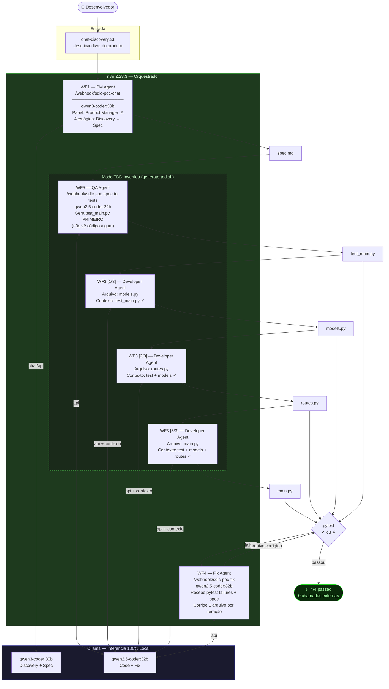
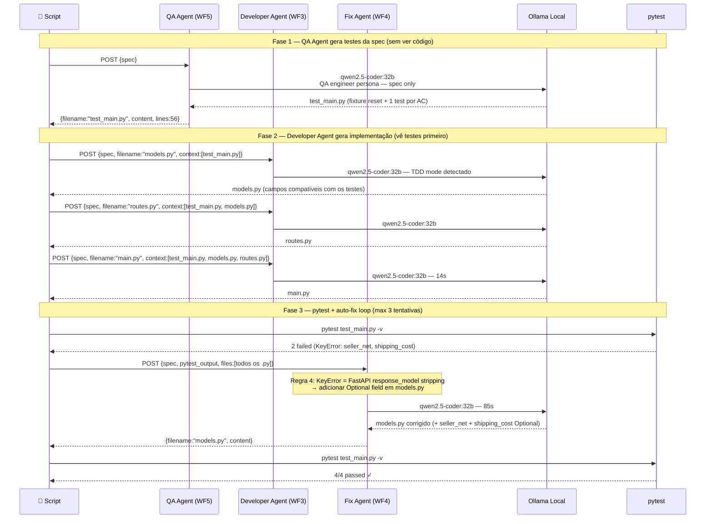
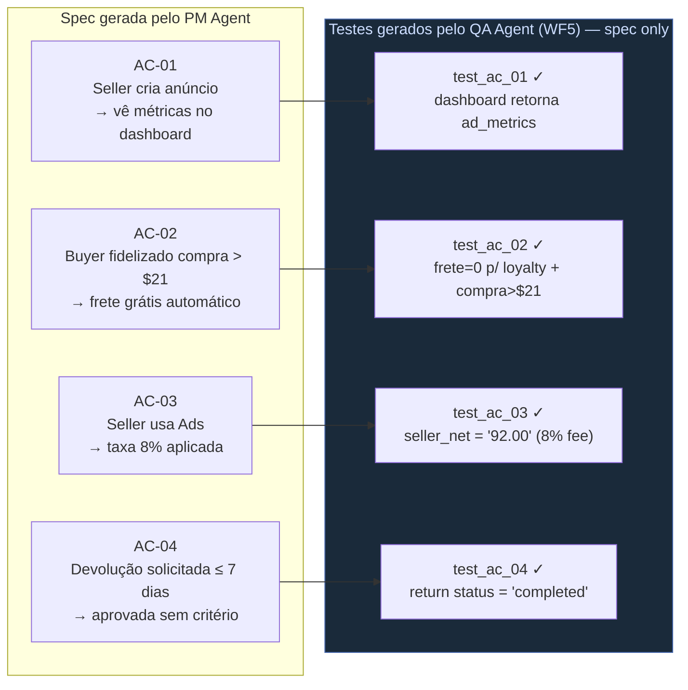
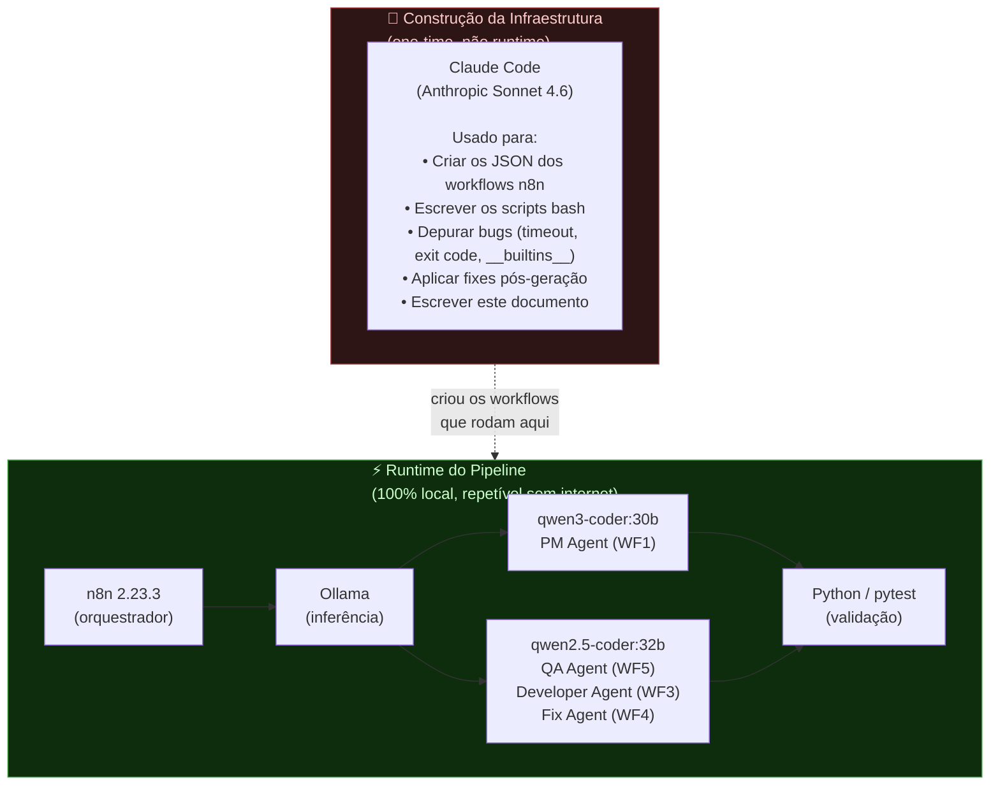
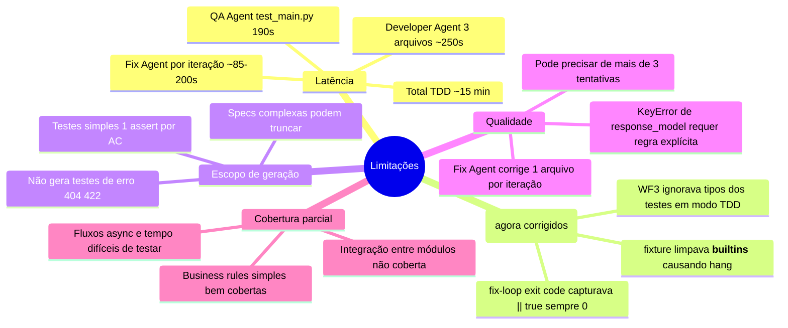

# Fluxo Agêntico Local — SDLC com 100% LLM Local

> Última atualização: 2026-06-20  
> Hardware: RTX 5060 Ti 16 GB VRAM  
> Inferência: Ollama (sem chamadas externas em runtime)

---

## 1. Visão Geral do Pipeline (com TDD Invertido e Auto-Fix)



---

## 2. Sequência Detalhada — TDD Invertido



---

## 3. Cobertura dos Critérios de Aceite (TDD Mode)



---

## 4. Construção vs Runtime



---

## 5. Métricas Comparativas

### Fluxo Code-First (geração anterior — generate-files.sh)

| Métrica | Valor |
|---|---|
| Tempo total discovery → pytest | ~15 min |
| Arquivos gerados | 4 |
| Linhas de código | 407 |
| Testes | 9 |
| Passando as-generated | 7/9 |
| Fixes manuais | **2** (autouse fixture + valor de cálculo) |
| Chamadas externas | **0** |

### Fluxo TDD Invertido (generate-tdd.sh — sessão atual)

| Métrica | Valor |
|---|---|
| Tempo total spec → pytest verde | ~7min geração + ~8min fixes |
| QA Agent (WF5) — test_main.py | 190s |
| Developer Agent (WF3) — 3 arquivos | 54s + 180s + 14s |
| Fix Agent (WF4) — 1 iteração | 85s |
| Passando as-generated | 1/4 |
| Passando pós auto-fix | **4/4** |
| Fixes manuais | **0** (só fixture corrigida no prompt do WF5) |
| Chamadas externas | **0** |

### O que o TDD Invertido eliminou

- **Divergência de nomes** — Code Agent vê os testes primeiro, usa os mesmos nomes de campo
- **Circularidade** — testes são escritos por agente diferente (QA), não pelo mesmo que gera código
- **Fixes manuais** — WF4 resolveu o `response_model stripping` automaticamente

---

## 6. Limitações Identificadas



---

## 7. Próximos Passos

| Item | Status | Prioridade |
|---|---|---|
| WF4 — Auto-fix loop | ✅ Implementado | — |
| WF5 — TDD Invertido | ✅ Implementado | — |
| `qwen2.5-coder:7b` — modelo rápido para iteração | Backlog | Alta |
| Langfuse — observabilidade de tokens/latência | Backlog | Média |
| WF6 — UX Wireframe (HTML/Tailwind por AC) | Backlog | Média |
| Contexto entre módulos (Seller + Fintech) | Backlog | Baixa |

---

## 8. Comando para Re-executar

```bash
# Fluxo completo Code-First (com auto-fix loop):
cd products/sdlc-hibrido/tests
./run-pipeline.sh research/sdlc-agentico/input/chat-discovery.txt /tmp/output-$(date +%Y%m%d)

# Fluxo TDD Invertido (testes antes do código):
./generate-tdd.sh /tmp/marketplace-spec.md /tmp/tdd-output-$(date +%Y%m%d)

# Só re-importar e ativar todos os workflows:
./import-workflows.sh
```

**Pré-requisitos:** n8n em `http://localhost:5678`, Ollama em `http://localhost:11434`, modelos `qwen3-coder:30b` e `qwen2.5-coder:32b` disponíveis.
